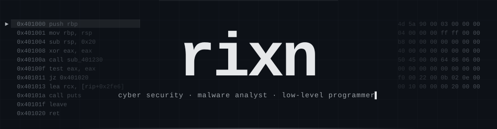

<!-- you read the source. good habit. -->

<p align="center"></p>

<p align="center">
  <a href="https://github.com/rixn-911"></a>
</p>

I'm rixn. i work in cyber security, mostly the quiet side of it: taking malware apart, reading code that was never meant to be read, and writing low-level programs in c++, go, python and a little assembly.

i like the layer where software stops pretending. past the ui, past the framework, past the api, there are bytes, memory and syscalls. that's where a program says what it actually does, and it's rarely what it claims to do.

most of my work happens at night, in a lab that is isolated on purpose.

---

## $ cat philosophy.txt

```text
1. every binary tells the truth if you read it low enough.
2. you can't defend what you don't understand.
3. break it to learn it. permission first, always.
4. if the tool doesn't exist, build it.
```

---

## $ cat ~/.focus

- **malware analysis** – samples go into an isolated lab, get watched, and get taken apart until they make sense
- **low-level programming** – memory layouts, pe/elf internals, syscalls, what the compiler really produced
- **cyber security** – understanding attacks well enough to detect them and shut them down
- **offensive work** – only with authorization, only to make the defense better

---

## $ ls ~/languages

```text
c++        home turf. memory, win32, anything that has to be fast and close to the metal
go         small, quick, portable. my pick for cli and network tooling
python     the glue. lab automation, analysis scripts, first drafts of ideas
asm        read it fluently, write it carefully. still levelling up
```

<p>
  
</p>

---

## $ grep -r "att&ck" ~/research

| id | technique | what i look for as a defender |
| :-- | :-- | :-- |
| `T1055` | process injection | cross-process memory writes, remote thread and apc anomalies |
| `T1620` | reflective code loading | unbacked executable regions, rwx allocations |
| `T1106` | native api / direct syscalls | syscall origin checks, call-stack inconsistencies |
| `T1562.001` | impair defenses | hook integrity, tampered `ntdll` stubs |
| `T1027` | obfuscated files | section entropy, packer fingerprints |
| `T1574.002` | dll side-loading | unexpected module load paths, signed-binary abuse |
| `T1497` | sandbox / vm evasion | hardening the lab so samples can't tell they're watched |

---

## $ ls ~/bench

<details>
<summary><b>peek.cpp</b> – is this file what it claims to be?</summary>

```cpp
#include <cstdint>
#include <cstdio>
#include <fstream>

#pragma pack(push, 1)
struct DosHeader { uint16_t e_magic; uint8_t pad[58]; uint32_t e_lfanew; };
#pragma pack(pop)

int main(int argc, char** argv) {
    if (argc < 2) return 2;
    std::ifstream f(argv[1], std::ios::binary);
    DosHeader dh{};
    f.read(reinterpret_cast<char*>(&dh), sizeof dh);
    if (dh.e_magic != 0x5A4D) { puts("not a PE"); return 1; }

    f.seekg(dh.e_lfanew);
    uint32_t sig{};
    f.read(reinterpret_cast<char*>(&sig), 4);
    printf("MZ ok | PE sig %s | e_lfanew 0x%X\n",
           sig == 0x4550 ? "ok" : "BAD", dh.e_lfanew);
}
```
</details>

<details>
<summary><b>entropy.go</b> – the first thing i check on a section</summary>

```go
func entropy(b []byte) float64 {
	var freq [256]float64
	for _, c := range b {
		freq[c]++
	}
	n, h := float64(len(b)), 0.0
	for _, f := range freq {
		if f == 0 {
			continue
		}
		p := f / n
		h -= p * math.Log2(p)
	}
	return h // sustained ~7.2+ usually means packed or encrypted
}
```
</details>

<details>
<summary><b>hello.asm</b> – raw syscalls, no libc</summary>

```nasm
; nasm -felf64 hello.asm && ld hello.o -o hello
section .data
msg: db "nevermore", 10
len: equ $ - msg

section .text
global _start
_start:
    mov rax, 1          ; sys_write
    mov rdi, 1          ; stdout
    lea rsi, [rel msg]
    mov rdx, len
    syscall
    mov rax, 60         ; sys_exit
    xor rdi, rdi
    syscall
```
</details>

---

## $ which tools

```text
reverse     ghidra · ida · binary ninja · radare2
debug       x64dbg · windbg · gdb · pwndbg
observe     procmon · sysmon · wireshark · fakenet-ng
detect      yara · sigma · capa
build       c++ · go · python · nasm
```

---

## $ tail ~/now

```text
[+] x64 assembly, getting fluent
[+] edr internals and telemetry
[+] kernel-mode detection
[-] sleep
```

---

## $ xxd rixn.txt

```hexdump
00000000  72 69 78 6e 20 3a 3a 20  63 79 62 65 72 20 73 65  |rixn :: cyber se|
00000010  63 75 72 69 74 79 20 2f  20 6d 61 6c 77 61 72 65  |curity / malware|
00000020  20 61 6e 61 6c 79 73 74  20 2f 20 6c 6f 77 2d 6c  | analyst / low-l|
00000030  65 76 65 6c 20 70 72 6f  67 72 61 6d 6d 65 72 20  |evel programmer |
00000040  3a 3a 20 6e 65 76 65 72  6d 6f 72 65 0a           |:: nevermore.|
0000004d
```

<p align="center"><sub><code>return 0;  // nevermore</code></sub></p>
